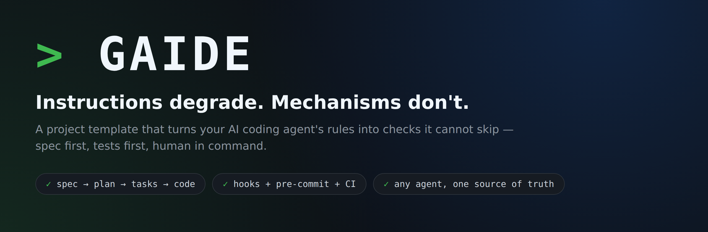
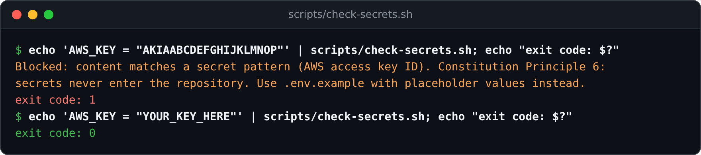
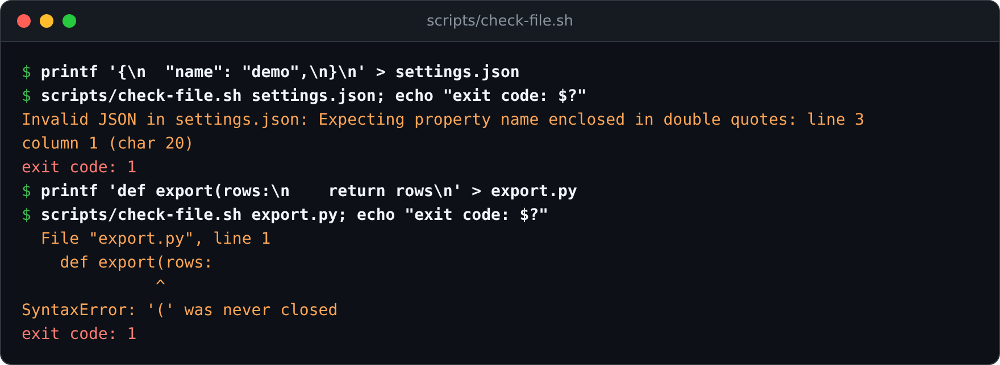
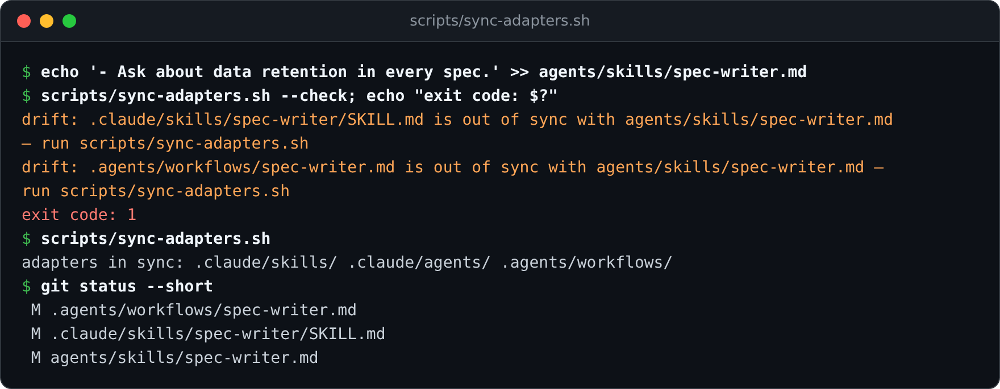
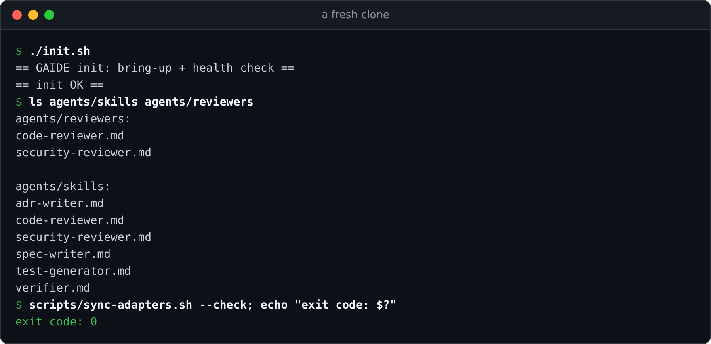
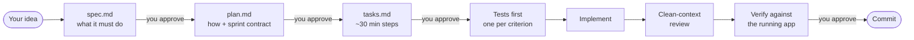

<p align="center">
  
</p>

<p align="center">
  <a href="LICENSE"></a>
  <a href="https://github.com/Ecoa-PUC-Rio/GAIDE/actions/workflows/security.yml"></a>
  
</p>

<p align="center">
  <a href="#quickstart">Quickstart</a> ·
  <a href="#see-it-work">See it work</a> ·
  <a href="#your-first-feature">Your first feature</a> ·
  <a href="docs/getting-started.md">Full walkthrough</a> ·
  <a href="#why-each-piece-exists">Why each piece exists</a>
</p>

---

**GAIDE is a project template for building software with AI coding agents without losing control of it.** Clone it, and your agent starts every session knowing how your team works — and, more importantly, *unable to skip the parts that matter*.

AI agents are fast, and they fail in predictable ways: they forget a rule halfway through a long session, call work "done" because the code was written, review their own diff and find it flawless, and — under pressure — quietly edit a test instead of fixing the bug. Writing "please don't do that" in a prompt does not hold. GAIDE answers each of those failures with a **mechanism** instead of an instruction:

| The agent tends to… | GAIDE answers with… |
| --- | --- |
| jump straight to code | a **spec → plan → tasks** flow with a human approval at each step |
| write a secret or broken file into the repo | **checks that reject the edit** the moment it happens |
| say "done" when the code merely exists | a task lifecycle where `verified` requires **exercising the running app** |
| approve its own work | a **clean-context reviewer** that sees only the diff and the spec |
| lose everything when the session ends | a session log, a bootstrap script, and decisions recorded as ADRs |
| work in only one vendor's tool | **one portable source of truth**, bound to each tool automatically |

It is plain Markdown and shell. No runtime, no SaaS, no lock-in — and no stack assumptions: `src/` is empty on purpose.

## See it work

Every capture below is real output from this repository, not a mock-up ([regenerate them](docs/assets/render.py) any time).

### A secret never reaches the repo

<p align="center"></p>

In Claude Code this check runs as a hook *before* every write: the tool call is rejected and the reason is fed straight back to the agent, so it corrects course while the context is fresh. Placeholders pass, so `.env.example` files still work.

### A broken edit is caught on the spot

<p align="center"></p>

Syntax feedback arrives right after the edit that caused it — not three steps later, when the agent has built more work on top of the breakage. The same slot runs security scanners (semgrep, osv-scanner) when they are installed.

### One source of truth for every tool

<p align="center"></p>

You edit a procedure once, in `agents/skills/`. One command regenerates the Claude Code skill and the Antigravity workflow from it, and CI fails if anyone lets them drift apart.

## Quickstart

You need `git`, `bash`, and `python3`. Nothing else is required to start.

```bash
git clone https://github.com/Ecoa-PUC-Rio/GAIDE my-project
cd my-project
rm -rf .git && git init      # start your own history
./init.sh                    # bring-up + health check
```

<p align="center"></p>

Now open the folder in your agent and ask for a feature — **describe the behavior, not the code**:

```text
/spec-writer I want to add: users can export their history as CSV
```

That is the whole setup. The agent will not start coding: it writes a spec first and waits for you.

> **Tip:** to see where this leads before writing anything, read the finished example in [`specs/example-feature/`](specs/example-feature/) — a complete spec, plan, and task list for exactly this CSV export.

## Your first feature



| Step | You type | What you get |
| --- | --- | --- |
| 1. Specify | `/spec-writer <the behavior you want>` | `specs/<feature>/spec.md` — use cases, acceptance criteria, out-of-scope, abuse cases. Then `plan.md` and `tasks.md`, each waiting for your approval. |
| 2. Test first | `/test-generator` | One or more tests per acceptance criterion — red, because nothing is implemented yet. |
| 3. Implement | "implement task 1" | Small, atomic changes, checked as they are written. |
| 4. Review | `/code-reviewer` | A reviewer with **no memory of the implementation** checks the diff against the spec and the constitution. |
| 5. Verify | `/verifier` | The agent runs the app and exercises each criterion as a user would. Only this moves a task to `verified`. |
| 6. Decide | `/adr-writer` (when an architectural choice was made) | The decision and its *why*, recorded in `docs/adr/`. |

You stay in command throughout: by default **nothing is committed without your explicit approval**. The step-by-step version, with what to expect at each stage, is in **[docs/getting-started.md](docs/getting-started.md)**.

## Works with your tool

The governed layer lives in portable files; each tool gets a thin, generated binding.

| | Briefing | Procedures | Inline enforcement | Pre-commit + CI enforcement |
| --- | --- | --- | --- | --- |
| **Claude Code** | automatic | `/name` skills + reviewer subagents | ✅ hooks reject bad edits as they happen; deny-permissions block credential reads and destructive commands | ✅ |
| **Google Antigravity** | automatic (`.agents/rules/`) | `/name` workflows | run the `scripts/` checks yourself | ✅ |
| **Cursor · Codex · Zed · Copilot · Gemini CLI** | automatic (`AGENTS.md`) | plain Markdown in `agents/skills/` — point the agent at one | run the `scripts/` checks yourself | ✅ |

One honest asymmetry: a hook that rejects a bad edit *the moment it happens* exists only where the tool has hook events — today, Claude Code. Everywhere else the same checks run at commit time (pre-commit) and push time (CI). That git-level layer is the guaranteed floor for every agent and every human, which is exactly the point: the protection that works everywhere does not depend on any IDE.

## What's in the box

- **Six skills** (`agents/skills/`) — `spec-writer`, `test-generator`, `code-reviewer`, `security-reviewer`, `verifier`, `adr-writer`. Reusable procedures, so quality does not vary by session.
- **Two clean-context reviewers** (`agents/reviewers/`) — code and security rubrics that judge a diff without the author's rationalizations.
- **Four enforcement checks** (`scripts/`) — secrets, per-file syntax, SAST + dependency scanning, and a "safe to walk away" check (no secrets, tests green).
- **A constitution** (`specs/constitution.md`) — ten non-negotiable principles, changeable only through an ADR.
- **Spec templates and a worked example** (`specs/`) — spec, plan with sprint contract, and task list.
- **CI and pre-commit** — gitleaks, semgrep, osv-scanner, and a binding drift check on everything that reaches the repo, whoever pushed it.
- **MCP configuration** (`.mcp.json`) — example servers (filesystem, Postgres read-only, GitHub, Playwright) with [per-tool setup notes](docs/mcp-setup.md).
- **Session continuity** — `init.sh` proves the project runs before new work starts; `PROGRESS.md` carries context between sessions.

<details>
<summary><b>Repository layout</b></summary>

```text
.
├── AGENTS.md                  Project briefing — canonical, read by every tool
├── agents/                    Portable procedures (single source of truth)
│   ├── skills/                Skills: spec-writer, code-reviewer, security-reviewer,
│   │                          verifier, adr-writer, test-generator
│   └── reviewers/             Clean-context reviewer rubrics (code, security)
├── scripts/                   Portable enforcement checks + adapter sync
│   ├── check-secrets.sh       Secret-pattern scan of content (stdin)
│   ├── check-file.sh          Per-file syntax check
│   ├── check-security.sh      SAST (semgrep) + dependency scan (osv-scanner) per file
│   ├── check-clean-state.sh   Uncommitted changes: no secrets, tests green
│   └── sync-adapters.sh       Regenerates the per-tool bindings below
├── .claude/                   Claude Code binding
│   ├── settings.json          Permissions and hook wiring
│   ├── CLAUDE.md              One-line import of AGENTS.md
│   ├── hooks/                 Thin adapters: hook payload -> scripts/ checks
│   ├── agents/                (generated) subagents from agents/reviewers/
│   └── skills/                (generated) skills from agents/skills/
├── .agents/                   Google Antigravity binding
│   ├── rules/gaide.md         Workspace rules pointing at AGENTS.md
│   └── workflows/             (generated) /name workflows from agents/skills/
├── .github/workflows/         Guaranteed harness: CI security scans + adapter drift check
├── .pre-commit-config.yaml    Same scanners for human committers
├── .mcp.json                  MCP servers — canonical reference (see docs/mcp-setup.md)
├── specs/                     Spec-Driven Development
│   ├── constitution.md        Non-negotiable principles
│   ├── README.md              How to use the SDD flow
│   ├── template/              Spec / plan / tasks templates
│   └── example-feature/       Complete example (spec → plan → tasks)
├── docs/                      Project documentation
│   ├── getting-started.md     First feature, step by step
│   ├── adr/                   Architecture Decision Records
│   ├── assets/                README images and the script that regenerates them
│   └── mcp-setup.md           Connecting the MCP servers in each tool
├── PROGRESS.md                Session log (local only, gitignored)
├── init.sh                    Session bootstrap: bring-up + health check
├── src/                       Source code (empty by design)
├── tests/                     Tests
├── LICENSE                    MIT
└── README.md                  This file
```

</details>

## Make it yours

After the quickstart, spend ten minutes on these — in this order:

1. **`AGENTS.md`** — fill in the bracketed fields (project, stack, conventions). Every tool reads it.
2. **`specs/constitution.md`** — read it as a team and edit it until you actually agree with it.
3. **Security scanners** — install them so the inline security layer activates (hooks skip silently without them; CI enforces either way):

   ```bash
   brew install semgrep gitleaks osv-scanner   # macOS
   # or: pipx install semgrep && go install github.com/zricethezav/gitleaks/v8@latest ...
   pipx install pre-commit && pre-commit install   # optional: same scanners for human commits
   ```

4. **`.mcp.json`** — point it at the systems you really use, drop the rest, then connect them per [`docs/mcp-setup.md`](docs/mcp-setup.md).
5. **`init.sh`** — replace the auto-detection with your project's real bring-up and health check as soon as you have one.
6. **Skills** — keep, drop, or edit them in `agents/skills/`, then run `scripts/sync-adapters.sh` and commit both the source and the regenerated bindings.

## Why each piece exists

GAIDE applies **harness engineering** — the discipline of shaping the environment an AI agent operates in, popularized by Anthropic's work on [long-running agent harnesses](https://www.anthropic.com/engineering/effective-harnesses-for-long-running-agents) and [harness design](https://www.anthropic.com/engineering/harness-design-long-running-apps). The core insight: **instructions degrade, mechanisms don't**. An agent under context pressure will forget or rationalize away a rule written in prose; it cannot ignore a hook that rejects its tool call.

Nothing here is decoration. Each piece exists for a specific failure mode of AI-assisted development:

<details>
<summary><b>The full map: mechanism → failure mode it prevents</b></summary>

| Mechanism | Failure mode it prevents |
| --- | --- |
| **Constitution** (`specs/constitution.md`) | Knowledge about "how we work here" living only in chat history |
| **Specs** (`specs/`) | Drift between what the app does and what people believe it does |
| **Enforcement checks** (`scripts/`, wired as hooks in `.claude/hooks/`) | The agent violating critical rules (e.g. committing secrets) under pressure — enforcement is deterministic, not trust-based |
| **Deny permissions** (`.claude/settings.json`) | The agent reading credentials or running destructive commands, even accidentally — policy stated for all tools in `AGENTS.md` ground rules; enforced mechanically where the tool supports it |
| **`PROGRESS.md`** session log | Each session starting blind — context windows die, durable artifacts don't |
| **`init.sh`** session bootstrap | Building on top of broken inherited state — every session proves the app runs *before* new work |
| **Task status lifecycle** (`specs/template/tasks.md`) | "Done" meaning "I wrote code" — `done` requires passing tests, `verified` requires independent checking against the spec |
| **Clean-context review** (`agents/reviewers/code-reviewer.md`) | Self-review bias — the context that wrote the code contains the rationalizations that produced its bugs, so the reviewer sees only the diff and the docs |
| **Sprint contracts** (`specs/template/plan.md`) | "Done" drifting during implementation — observable done-criteria are agreed before coding and checked one by one at review |
| **`verifier` skill** (+ Playwright MCP) | "Tests pass" being mistaken for "it works" — criteria reach `verified` only by exercising the running app as a user would |
| **ADRs** (`docs/adr/`) | Re-litigating settled decisions; losing the *why* behind the architecture |
| **Skills** (`agents/skills/`) | Reinventing procedures ad hoc, with quality varying per session |
| **Principle 9** (tests are load-bearing) | The agent editing tests or task lists to make work *appear* done — a failure mode Anthropic observed directly in long-running agents |
| **Security checks** (`scripts/check-security.sh`, gitleaks in `scripts/check-clean-state.sh`) | Vulnerable code or dependencies entering silently — semgrep/osv-scanner findings block the edit and feed back while context is fresh |
| **Principle 10** (security findings are load-bearing) | The agent silencing scanners (`# nosemgrep`, ignore files) instead of fixing the vulnerability — suppressions only in dedicated, justified commits |
| **Security considerations** in specs (`specs/template/spec.md`) | Logic-level flaws no scanner sees (IDOR, authz bypass, tenant leakage) — abuse cases become negative acceptance criteria, tested and verified |
| **`security-reviewer`** (`agents/reviewers/`) | Scanner blind spots at review time — authorization reasoning, abuse-case coverage, and diffs that quietly disarm the scanners |
| **CI + pre-commit** (`.github/workflows/security.yml`, `.pre-commit-config.yaml`) | Hooks only guard the agent's session — CI and pre-commit extend the same scanners to every commit from anyone |

</details>

The adoption of these practices is recorded in [ADR 0001](docs/adr/0001-adopt-harness-engineering-practices.md), [ADR 0002](docs/adr/0002-adopt-security-harness.md) (security harness), and [ADR 0003](docs/adr/0003-agent-agnostic-layout.md) (agent-agnostic layout).

### Portable by design

The template separates **portable policy** from **per-tool binding**, so switching (or mixing) agentive tools does not cost you the governed layer:

- **Portable, read by everything:** `AGENTS.md` (the open cross-tool briefing standard), `agents/` (skills and reviewer rubrics as plain Markdown), `scripts/` (enforcement checks as plain shell), `specs/`, `docs/adr/`, `init.sh`, pre-commit, CI.
- **Bindings, generated or thin:** `.claude/` (Claude Code) and `.agents/` (Antigravity) are dialect wrappers. `scripts/sync-adapters.sh` regenerates them from the portable sources — edit the source, run the sync, commit both; CI fails on drift.

## Philosophy

Vibe coding works best with guardrails. The template enforces ten non-negotiables (full text and rationale in [`specs/constitution.md`](specs/constitution.md)):

1. **Spec before code** — describe observable behavior before generating implementation
2. **Tests track behavior** — every behavioral change needs tests
3. **Human approval before commit** — Human-In-Command (HIC) mode by default
4. **Comments explain *why*, not *what*** — naming documents the what
5. **Architectural decisions become ADRs** — immutable, traceable
6. **Secrets never enter the repo** — even in example files
7. **Atomic changes** — one concern per commit/PR
8. **Fail loudly, not silently** — no swallowed errors
9. **Tests and task lists are load-bearing** — never edited to make work *appear* done
10. **Security findings are load-bearing** — scanners are fixed against, never silenced

You can relax any of these as your team matures — but only via an explicit ADR.

<details>
<summary><b>Operating standards and the session loop</b></summary>

The principles are reinforced by Karpathy-inspired operating standards that keep agent work deliberate and minimal:

- **Think before coding** — surface assumptions, ask clarifying questions, and avoid silent interpretation.
- **Simplicity first** — choose the minimum code that solves the problem; avoid speculative abstractions.
- **Surgical changes** — change only what is required and leave unrelated code untouched.
- **Goal-driven execution** — define verifiable success criteria and test the result explicitly.

A practical session loop for the agent is:

1. Read the brief and repo rules.
2. State assumptions and ambiguities.
3. Define the acceptance criteria before coding.
4. Check for the relevant spec and tests.
5. Make the smallest possible change.
6. Validate with the smallest relevant check.
7. Review the diff for scope drift and report evidence.

</details>

## FAQ

**Do I need Claude Code?** No. Every tool listed above reads the briefing, and pre-commit plus CI enforce the same checks for all of them. Claude Code additionally gets inline hooks and deny-permissions, because it is the tool that exposes the events to attach them to.

**Does this slow me down?** It moves effort to the front. A spec costs minutes; discovering after 2,000 generated lines that the agent built the wrong thing costs the afternoon. Trivial fixes with no behavioral change are exempt from the spec requirement.

**Is it tied to a language or framework?** No. The bootstrap and checks cover common stacks out of the box and are meant to be extended; `src/` and `tests/` ship empty.

**Can the agent work more autonomously?** Yes — deliberately. Human-in-command is the default; moving to a more autonomous mode is a recorded decision (an ADR), not a setting someone flips quietly.

**What if a rule does not fit my team?** Change it. The constitution is yours to edit; the only requirement is that the change is explicit and recorded.

## Contributing

This is a community template. PRs that improve the defaults, skills, or documentation are welcome. Please open an issue first to discuss substantial changes.

## License

[MIT](LICENSE) — free to use, modify, and distribute, including commercially.
